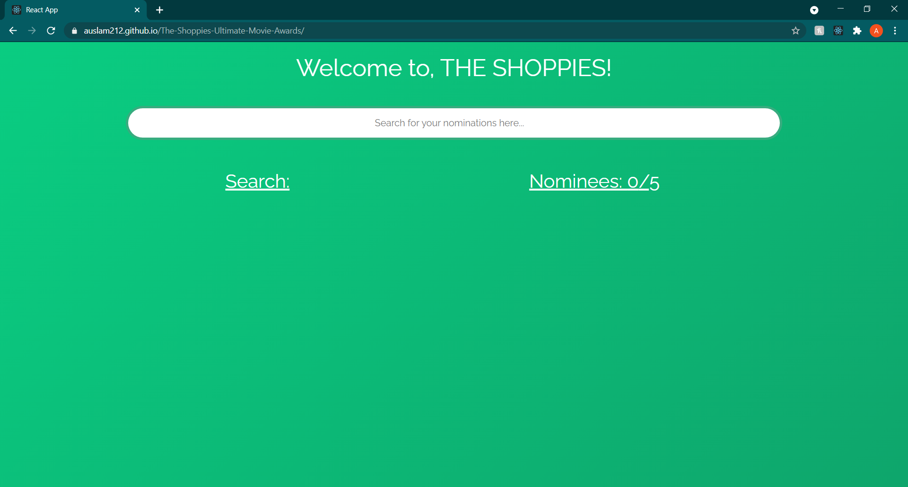
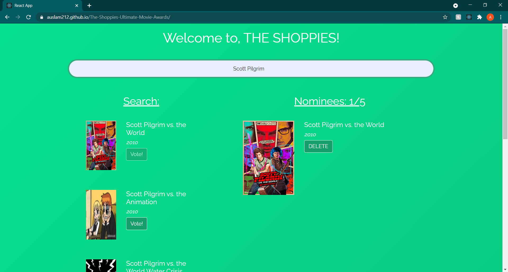
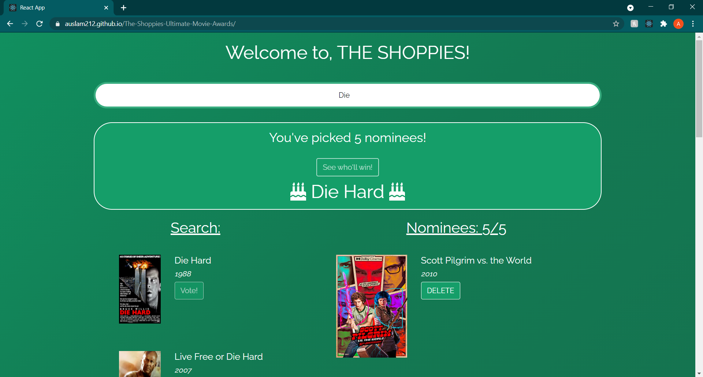

# The-Shoppies-Ultimate-Movie-Awards

The Shoppies Ultimate Movie Awards allows users to search through the OMDB movie API so that they may nominate their top five movie selections of ALL TIME. Obviously that's a pretty big deal!

## Usage

The application starts with an input bar that prompts the user to search for the movies they wish to nominate.

The user is then given a list of movies they can select to nominate, which are returned by the OMDB API. Once a nomination is chosen the button is disabled on the search and the movie is added to the nomination list on the right. Nominations can also be deleted.

Once five movies are chosen, a banner surfaces on the top of the page, and a button appears that announces a winner!

## Deployed at:

https://auslam212.github.io/The-Shoppies-Ultimate-Movie-Awards/

## Author

Austin Lambert
https://github.com/AusLam212

## Questions

For questions on this application, contact me at atlambert11@gmail.com.
